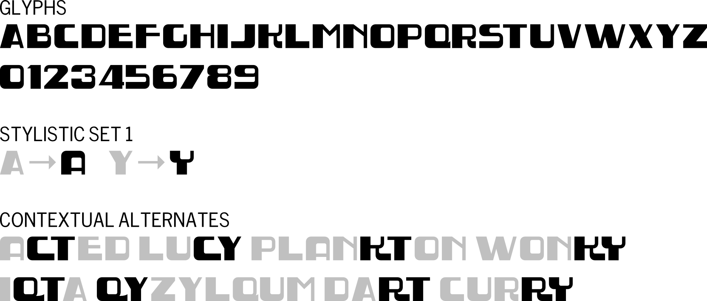

# Art Disco

On a trip to France, the lettering on a manhole cover caught my eye, so I took a photo with the full intent of redrawing it. Once finished, it looked terrible. What worked so well in the metal, just did not work as a font. However, I saw something.

Rounding some of the corners similar to wear on the manhole cover, it took on a whole new life. Abandoning the original design of characters such as _K_ and _R_ further transformed its character. And that's how we ended up here.

## Disclaimer

This initial version is very basic. It contains only Latin uppercase and numbers. I added alternate _A_ and _Y_ glyphs as a stylistic set, and some contextual alternates to fill some gaps.

I will look into expanding the glyph coverage to at least add basic punctuation and diacritics, and add hinting at some point.

## Fonts

Art Disco consists of a web font and OpenType font in a single weight.

Look in the `fonts/otf/` folder for the desktop fonts, and the `fonts/webfonts/` folder for the web fonts.

## License

Copyright (c) 2023, Barry Mieny (<https://barry.mieny.com>)

This Font Software is licensed under the SIL Open Font License, Version 1.1. This license is included in this repository ([OFL.txt](OFL.txt)) and is also available with an FAQ at: <https://scripts.sil.org/OFL>
